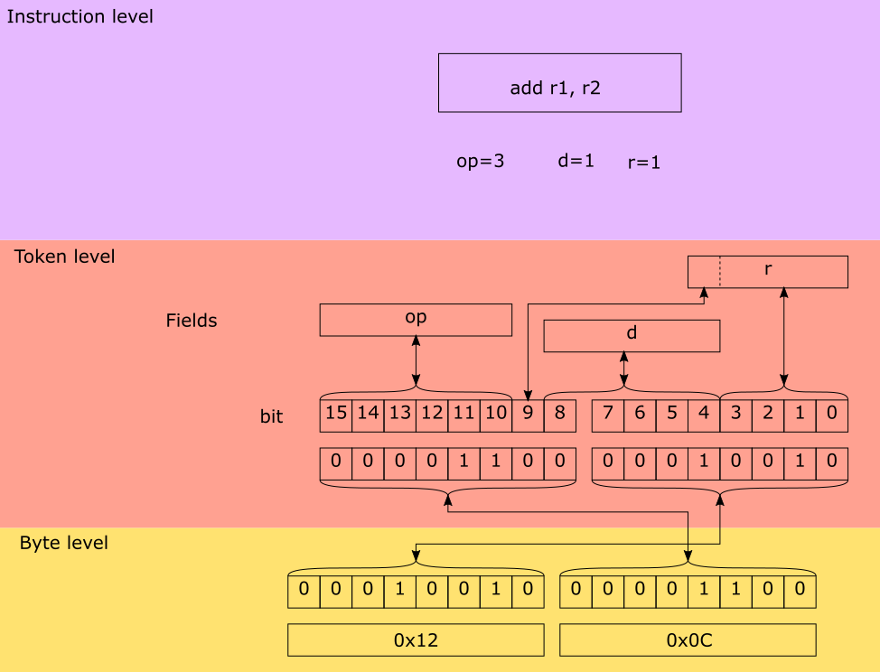

Specification languages
=======================

Introduction
------------

`DRY`

Do not repeat yourself (DRY). This is perhaps the most important idea
to keep in mind when
writing tools like assemblers, disassemblers, linkers, debuggers and
compiler code generators. Writing these tools can be a repetitive and error
prone task.

One way to achieve this is to to write a specification file for a specific
processor and generate from this file the different tools.
The goal of a machine description file is to describe a file and generate
tools like assemblers, disassemblers, linkers, debuggers and simulators.

.. graphviz::

    digraph x {
        1 [label="CPU specification"]
        2 [label="spec compiler"]
        10 [label="assembler"]
        11 [label="compiler back-end"]
        12 [label="simulator"]
        1 -> 2
        2 -> 10
        2 -> 11
        2 -> 12
    }

Design
------

The following information must be captured in the specification file:

* Assembly textual representation
* Binary representation
* Link relocations
* Mapping from compiler back-end
* Effects of instruction (semantics)

The following image depicts the encoding and decoding of the AVR add
instruction.

The following code demonstrates how this instruction is described:

.. code:: python

    class Add(AvrInstruction):
        tokens = [AvrArithmaticToken]
        rd = register_argument('rd', AvrRegister, read=True, write=True)
        rr = register_argument('rr', AvrRegister, read=True)
        syntax = Syntax(['add', rd, ',', rr])
        patterns = [
            FixedPattern('op', 0b11),
            SubPattern('r', rr),
            SubPattern('d', rd)]

Background
----------

There are several existing languages to describe machines in a Domain
Specific Language (DSL). Examples of these are:

* Tablegen (llvm)
* cgen (gnu)
* LISA (Aachen)
* nML (Berlin)
* SLED (Specifying representations of machine instructions (norman ramsey and Mary F. Fernandez)) [sled]_

Concepts to use in this language:

* Single stream of instructions
* State stored in memory
* Pipelining
* Instruction semantics

Optionally a description in terms of compiler code generation can be attached
to this. But perhaps this clutters the description too much and we need to put
it elsewhere.

The description language can help to expand these descriptions by expanding
the permutations.

Example specifications
----------------------

For a complete overview of ADL (Architecture Description Language) see [overview]_.

llvm
~~~~

.. code::

    def IMUL64rr : RI<0xAF, MRMSrcReg, (outs GR64:$dst),
                                       (ins GR64:$src1, GR64:$src2),
                       "imul{q}\t{$src2, $dst|$dst, $src2}",
                       [(set GR64:$dst, EFLAGS,
                           (X86smul_flag GR64:$src1, GR64:$src2))],
                       IIC_IMUL64_RR>,
                    TB;

LISA
~~~~

.. code::

    <insn> BC
    {
      <decode>
      {
        %ID: {0x7495, 0x0483}
        %cond_code: { %OPCODE1 & 0x7F }
        %dest_address: { %OPCODE2 }
      }
      <schedule>
      {
        BC1(PF, w:ebus_addr, w:pc) |
        BC2(PF, w:pc), BC3(IF) |
        BC4(ID) |
        <if> (condition[cond_code])
        {
          BC5(AC) |
          BC6(PF), BC7(ID), BC8(RE) |
          BC9(EX)
        }
        <else>
        {
          k:NOP(IF), BC10(AC, w:pc) |
          BC11(PF), BC12(ID), BC13(RE) |
          k:NOP(ID), BC14(EX) |
          k:NOP(ID), k:NOP(AC) |
          k:NOP(AC), k:NOP(RE) |
          k:NOP(RE), k:NOP(EX) |
          k:NOP(EX)
        }
      }
      <operate>
      {
        BC1.control: { ebus_addr = pc++; }
        BC2.control: { ir = mem[ebus_addr]; pc++ }
        BC10.control: { pc = (%OPCODE2) }
      }
    }

SLED
~~~~

.. code::

    patterns
      nullary is any of [ HALT NEG COM SHL SHR READ WRT NEWL NOOP TRA NOTR ],
        which is op = 0 & adr = { 0 to 10 }
    constructors
      IMULb        Eaddr            is      (grp3.Eb;    Eaddr) & IMUL.AL.eAX

nML
~~~

.. code::

    type word = card(16)
    type absa = card(9)
    type disp = int(4)
    type off = int(6)
    mem PC[1,word]
    mem R[16,word]
    mem M[65536,word]
    var L1[1,word]
    var L2[1,word]
    var L3[1,word]
    mode register(i:card(4)) = R[i]
      syntax = format(”R%s”, i)
      image = format(”%4b”, i)
    mode memory = ind | post | abs
    mode ind(r:register, d:disp) = M[r+d]
      update = {}
      syntax = format(”@%s(%d)”, r.syntax, d)
      image = format(”0%4b%4b0”, r.image, d)
    mode post(r:register, d:disp) = M[r+d]
      update = { r = r + 1; }
      syntax = format(”@%s++(%d)”, r.syntax, d)
      image = format(”0%4b%4b1”, r.image, d)
    mode abs(a : absa) = M[a]
      update = {}
      syntax = format(”%d”, a)
      image = format(”1%9b”, a)
    op instruction( i : instr )
      syntax = i.syntax
      image = i.image
      action = {
        PC = PC + 1;
        i.action;
      }
    op instr = move | alu | jump
    op move(lore:card(1), r:register, m:memory)
      syntax = format(”MOVE%d %s %s”, lore, r.syntax, m.syntax)
      image = format(”0%1b%4b%10b”, lore, r.image, m.image)
      action = {
        if ( lore ) then r = m;
        else m = r;
        endif;
        m.update;
      }
    op alu(s1:register, s2:register, d:reg, a:aluop)
      syntax = format(”%s %s %s %s”, a.syntax, s1.syntax, s2.syntax, d.syntax)
      image = format(”10%4b%4b%4b%2b”, s1.image, s2.image, d.image, a.image)
      action = {
        L1 = s1; L2 = s2; a.action; d = L3;
      }
    op jump(s1:register, s2:register, o:off)
      syntax = format(”JUMP %s %s %d”, s1.syntax, s2.syntax, o)
      image = format(”11%4b%4b%6b”, s1.image, s2.image, o)
      action = {
       if ( s1 >= S2 ) then PC = PC + o;
       endif;
      }
    op aluop = and | add | sub | shift;
    op and() syntax = ”and” image = ”00” action = { L3 = L1 & L2; }
    op add() syntax = ”add” image = ”10” action = { L3 = L1 + L2; }
    op sub() syntax = ”sub” image = ”01” action = { L3 = L1 - L2; }

.. [sled] http://www.cs.tufts.edu/~nr/toolkit/
.. [overview]   http://esl.cise.ufl.edu/Publications/iee05.pdf
